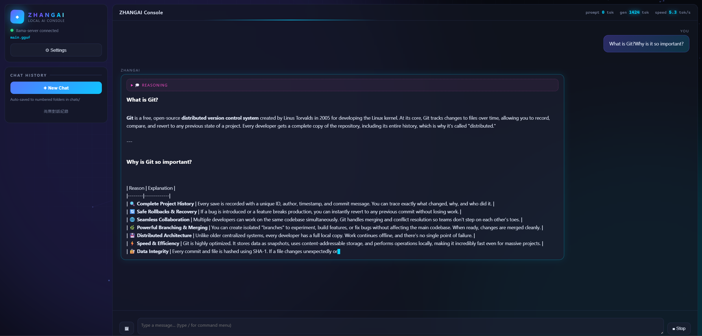
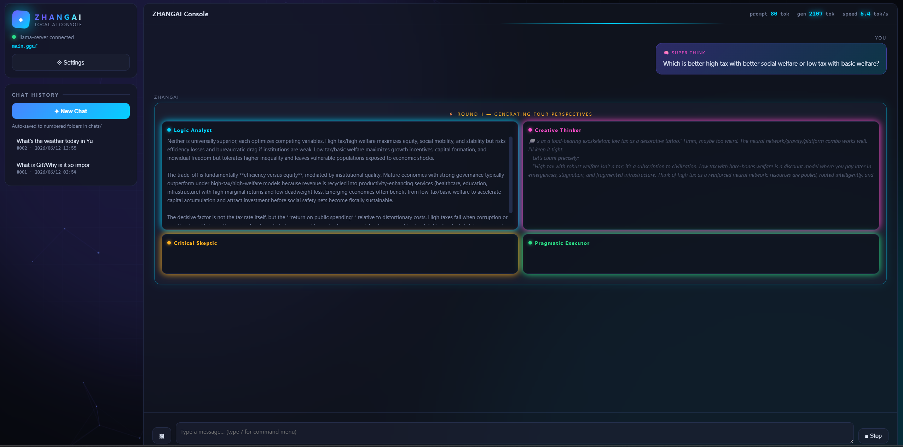
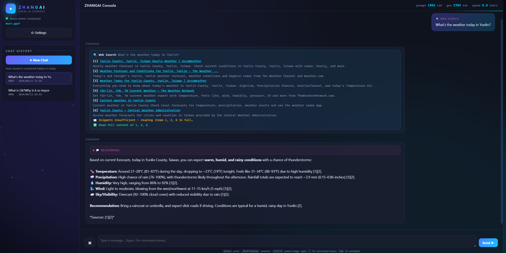
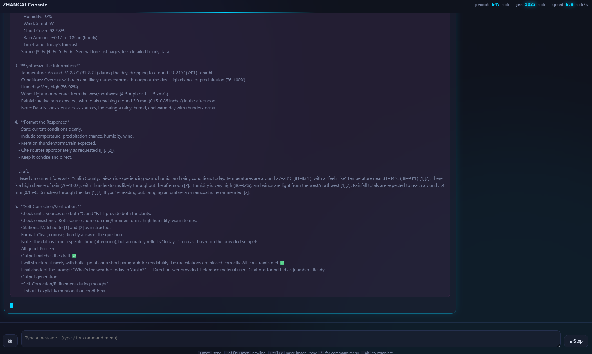
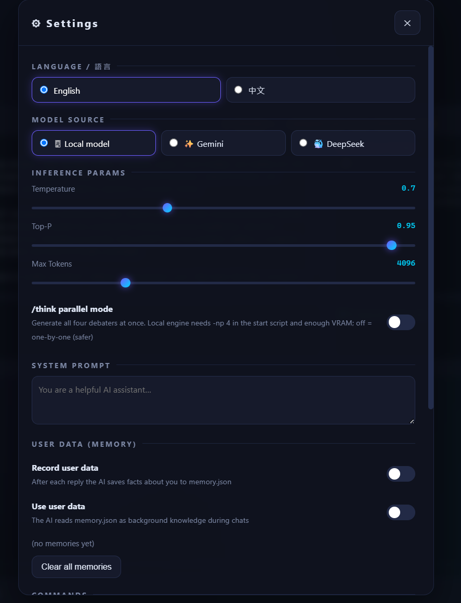

# ZHANGAI · Local AI Console

**[English](README.md)** | 繁體中文

> 一個介面更酷的本地 LLM 主控台 — 類 Ollama,但內建視覺辨識、工具調用、多 AI 辯論、網路搜尋與長期記憶。
> 純 llama.cpp + Python 標準庫 + 單檔前端,無框架、無資料庫、零雲端依賴。



## ✨ 特色

- **深色霓虹介面** — 粒子連線背景、流光 Logo、生成中彩虹邊框、逐字串流與即時 tok/s 統計,介面支援中文/English 切換
- **視覺模型支援** — 拖曳 / 貼上 / 上傳圖片,搭配 mmproj 投影器即可讓模型看圖
- **`/skill` 工具模式** — AI 可調用 `skills/` 內的本地工具(讀寫 DOCX、檔案操作、計算、Stable Diffusion 生圖…),丟一個 `.py` 進去就是新工具
- **`/think` 超級思考** — 4 個 AI 角色(邏輯/創意/批判/務實)各自給觀點,主持人按「共識/分歧/最終答案」裁決
- **`/search` 網路搜尋** — 無頭 Chrome 搜 Google(備援 Bing/DDG),AI 判斷摘要夠不夠,不夠才深讀內文,回答附來源編號
- **長期記憶** — 可選擇讓 AI 在對話後自動將使用者資訊寫入 `memory.json`,跨對話記得你
- **對話管理** — 每個對話自動存成 `chats/編號/chat.json`,可編輯、重送、重新生成、生成中開新視窗看別的對話
- **三種模型來源** — 本地 llama.cpp / Gemini API / DeepSeek API,設定頁一鍵切換
- 指令選單(輸入 `/` 喚出、Tab 補全)、可調參數、系統提示、全部設定自動保存

## 🚀 快速開始

需求:**Python 3.8+**(`/search` 功能另需 Chrome 瀏覽器)

```
1. 執行 setup_llama.bat(Windows)或 ./setup_llama.sh(macOS/Linux)
   → 自動偵測你的顯卡(CUDA / Vulkan / CPU / Metal)並下載對應的 llama.cpp

2. 下載模型 — 二選一:
   a) 執行 download_model.bat / ./download_model.sh
      → 互動選量化等級,自動下載預設模型(Qwen3.6-35B,支援視覺,apache-2.0)
   b) 自備任何 GGUF,放進 model/ 並命名:
      model/main.gguf      ← 語言模型(必要)
      model/mmproj.gguf    ← 視覺投影器(可選,沒有就不能看圖)

3. 執行 start.bat(Windows)或 ./start.sh(macOS/Linux)
   → 瀏覽器開 http://localhost:8080
     (單一終端機:llama-server 由後端自動以 :8090 啟動,原生網頁已停用)
```

### 換模型?

把任何 GGUF 改名成 `main.gguf` 丟進 `model/` 即可。context 長度、GPU 層數在 `start.bat` / `start.sh` 開頭的 `CTX` / `NGL` 變數調整。

預設模型 [HauhauCS/Qwen3.6-35B-A3B-Uncensored-HauhauCS-Aggressive](https://huggingface.co/HauhauCS/Qwen3.6-35B-A3B-Uncensored-HauhauCS-Aggressive) 的量化等級對照(下載腳本可選):

| 量化 | 大小 | 建議 VRAM |
|---|---|---|
| IQ2_M | 11.7 GB | ~12 GB(最低門檻) |
| IQ3_M | 15.4 GB | ~16 GB(推薦) |
| IQ4_XS | 18.7 GB | ~20 GB |
| Q4_K_M | 21.2 GB | ~24 GB |
| Q5_K_P | 28 GB | ~32 GB |

> ⚠️ **關於預設模型:**這是社群微調的 *uncensored(無限制)* 版本,內建拒答極少,可能生成主流助手會拒絕的內容。僅供本地個人使用;**使用方式與遵守當地法律完全由使用者自行負責。**想要有安全限制的模型,把任何標準 GGUF 放進 `model/main.gguf` 即可。

## 🗂 專案結構

```
front/index.html   前端(單檔,無建置步驟,內建中英 i18n)
server.py          後端(Python 標準庫:靜態伺服、對話存檔、LLM 代理、搜尋、記憶)
skills/*.py        工具模組,每個檔案 = 一個 AI 可調用的工具
skills/skills.json 工具清單(啟動時自動生成)
model/             你的 GGUF 模型
llama/             llama.cpp 引擎(setup 腳本自動下載)
chats/             對話紀錄(編號資料夾 + chat.json)
memory.json        使用者長期記憶
```

## 🔧 寫你自己的 Skill

在 `skills/` 放一個 `.py`,定義 `SKILL` 與 `run()`,重啟即生效:

```python
SKILL = {
    "name": "hello",
    "desc": "示範工具:打招呼",
    "params": {"name": "對象名稱"},
}

def run(args):
    return {"ok": True, "text": f"Hello, {args.get('name','world')}!"}
```

## 🖼 截圖

| `/think` — 4 AI 辯論 | `/search` — 即時網路搜尋 |
|---|---|
|  |  |

| 思考過程檢視 | 設定面板 |
|---|---|
|  |  |

## 🤝 參與貢獻

歡迎提 [Issue](../../issues) 回報問題或許願功能,也歡迎直接發 [Pull Request](../../pulls)(中英文皆可):

1. Fork 本專案並建立分支
2. 提交修改(請附上修改說明與測試方式)
3. 發 PR — 貢獻內容視為以本專案授權條款授權

## 📄 授權

[ZNC-1.0](LICENSE) — **非商業**使用免費;可拷貝、可修改、可再散布,但必須在前端介面可見處保留原作者署名 **Chris Zhang**,且修